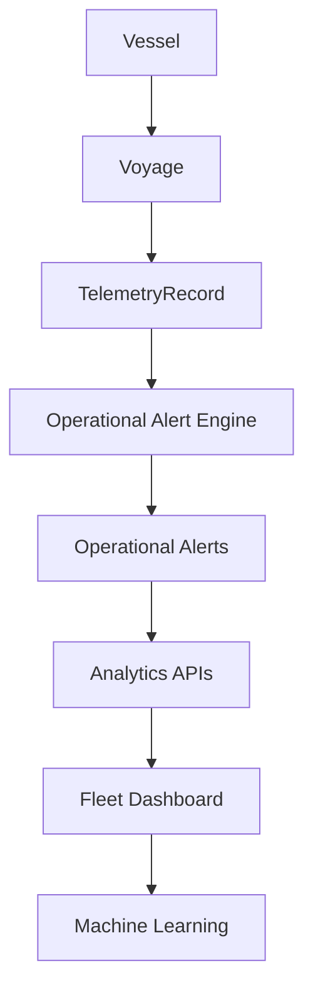

# 🚢 FleetIQ

<div align="center">

# AI-Powered Fleet Operations and Operational Intelligence Platform

Monitor fleet health, detect operational risks, analyse telemetry data, and prepare for predictive maintenance through machine learning.


</div>

---

# 🌐 Live Demo

**Application:** https://fleetiq-maritime.up.railway.app

Key Areas:

* Landing Page
* Fleet Analytics Dashboard
* Vessel Operations Portal
* Fleet Health Monitoring
* Operational Alerts
* Machine Learning Foundation

---

# 📖 Overview

FleetIQ is a cloud-deployed operational intelligence platform designed to help operators monitor fleet performance, detect operational risks, analyse telemetry data, and support data-driven decision making.

The platform demonstrates how modern operational systems transform raw telemetry into actionable business intelligence through dashboards, REST APIs, alerting systems, fleet health analytics, and machine learning.

FleetIQ combines:

* Fleet Operations Management
* Operational Intelligence
* Telemetry Analytics
* Machine Learning
* Cloud Deployment
* Interactive Dashboards

into a single enterprise-style application.

---

# 🎯 Project Goals

FleetIQ was created to demonstrate the integration of:

* Software Engineering
* Backend Development
* Operational Analytics
* Machine Learning
* Cloud Deployment

within a realistic enterprise-style platform.

The architecture intentionally mirrors systems used in:

* Maritime Operations
* Logistics Platforms
* Fleet Management Systems
* Industrial Monitoring
* IoT Analytics Platforms

---

# 🚀 Current Capabilities

* 14+ REST API endpoints
* Fleet health scoring
* Vessel operational analytics
* Interactive dashboard
* Telemetry simulation engine
* Operational alert engine
* Machine learning pipeline
* PostgreSQL backend
* Railway deployment
* Synthetic data generation

---

# ✨ Features

## 🚢 Fleet Operations

* Vessel management
* Voyage management
* Fleet status monitoring
* Vessel health scoring
* Fleet health distribution
* Vessel operational dashboards

## 📡 Telemetry Analytics

Generated telemetry includes:

* Vessel speed
* Fuel consumption
* Engine temperature
* Weather risk score
* Time-series measurements

Telemetry generation supports configurable risk profiles including healthy, watch, and high-risk operational scenarios.

## 🚨 Operational Alert Engine

Automatically generated alerts include:

* Engine Overheat
* Fuel Anomaly
* Weather Warning
* Delay Risk
* Speed Anomaly

These alerts drive fleet health assessment and machine learning feature generation.

## 📊 Interactive Analytics Dashboard

* KPI cards
* Fleet health analytics
* Latest alerts
* Alert severity distribution
* Alert type distribution
* Alert trends over time
* Top vessels by alerts
* Interactive drill-down navigation

---

# 🏗️ System Architecture



---

# 🤖 Machine Learning Pipeline

FleetIQ contains a machine learning workflow for vessel risk assessment.

Current implementation:

```text
Telemetry Records
        ↓
Feature Engineering
        ↓
Vessel Feature Dataset
        ↓
Risk Label Generation
        ↓
Random Forest Training
        ↓
Model Persistence
```

Current capabilities:

* Feature engineering
* Vessel-level dataset generation
* Train/test split
* Random Forest training
* Model persistence using Joblib

Current features:

* Average speed
* Average engine temperature
* Average weather risk
* Average fuel consumption
* Total alerts

Future enhancements:

* Predictive maintenance
* ETA prediction
* Fuel anomaly prediction
* Vessel risk forecasting

---

# 🚢 Vessel Operations Portal

Each vessel includes a dedicated operational dashboard containing:

* Vessel information
* Operational KPIs
* Health score
* Voyage history
* Alert history
* Alert filtering
* Alert sorting
* Alert pagination

---

# 🌐 REST APIs

## Dashboard APIs

| Endpoint                           | Description                 |
| ---------------------------------- | --------------------------- |
| `/api/dashboard/kpis/`             | Dashboard KPIs              |
| `/api/alerts/latest/`              | Latest alerts               |
| `/api/alerts/summary-by-type/`     | Alert type distribution     |
| `/api/alerts/summary-by-severity/` | Alert severity distribution |
| `/api/alerts/over-time/`           | Alert trends                |
| `/api/alerts/top-vessels/`         | Top vessels by alerts       |
| `/api/voyages/status-summary/`     | Voyage status summary       |

## Vessel APIs

| Endpoint                           | Description    |
| ---------------------------------- | -------------- |
| `/api/vessels/`                    | Vessel list    |
| `/api/vessels/<id>/`               | Vessel details |
| `/api/vessels/<id>/voyages/`       | Vessel voyages |
| `/api/vessels/<id>/alerts/`        | Vessel alerts  |
| `/api/vessels/<id>/kpis/`          | Vessel KPIs    |
| `/api/vessels/<id>/health-status/` | Vessel health  |

## Fleet APIs

| Endpoint                          | Description               |
| --------------------------------- | ------------------------- |
| `/api/fleet/health-distribution/` | Fleet health distribution |

---

# ☁️ Deployment Architecture

FleetIQ is deployed using Railway.

```text
GitHub
   ↓
Railway
   ↓
PostgreSQL
   ↓
Production Application
```

Production stack:

* Railway
* PostgreSQL
* Gunicorn
* WhiteNoise
* Environment Variables
* Production Django Configuration

---

# 📂 Project Structure

```text
fleetiq/

├── core/
│
├── operations/
│   ├── models.py
│   ├── serializers.py
│   ├── views.py
│   ├── urls.py
│   │
│   ├── services/
│   │   ├── alert_engine.py
│   │   ├── services_utils.py
│   │   └── ml_features.py
│   │
│   ├── management/
│   │   └── commands/
│   │
│   ├── templates/
│   └── static/
│
├── requirements.txt
├── manage.py
└── README.md
```

---

# 🛠️ Technology Stack

## Backend

* Python
* Django
* Django REST Framework

## Database

* PostgreSQL

## Analytics & Machine Learning

* pandas
* NumPy
* scikit-learn
* joblib

## Frontend

* HTML
* CSS
* JavaScript
* Chart.js

## Deployment

* Railway
* Gunicorn
* WhiteNoise

---

# 🚀 Setup

```bash
git clone https://github.com/karianjahi/fleetiq.git

cd fleetiq

python -m venv venv

source venv/bin/activate

pip install -r requirements.txt

python manage.py migrate

python manage.py createsuperuser

python manage.py runserver
```

---

# 🧪 Generate Demo Data

Generate synthetic fleet data:

```bash
python manage.py generate_demo_data
```

Generated data includes:

* Vessels
* Voyages
* Telemetry Records
* Operational Alerts
* Fleet Health Profiles

The synthetic data engine produces realistic operational scenarios for analytics and machine learning experimentation.

---

# 🚀 Roadmap

## Current Release

✓ Fleet Analytics

✓ Vessel Analytics

✓ Fleet Health Monitoring

✓ Operational Alert Engine

✓ Machine Learning Pipeline

✓ Railway Deployment

## Next Release

□ Model Evaluation Metrics

□ Prediction APIs

□ Vessel Risk Prediction Dashboard

## Future Releases

□ Predictive Maintenance

□ ETA Prediction

□ AI Operational Summaries

□ Natural Language Fleet Queries

□ Operational Recommendations

□ Real-Time Telemetry Streaming

---

# 📚 Documentation

Available documentation:

* Software Architecture Document
* Technical Design Document
* Deployment Architecture
* API Reference

Documentation is available in the `/docs` directory.

---

# 👨‍💻 Author

## Dr. rer. nat. Joseph Karianjahi Njeri

* Data Science
* Backend Engineering
* Full-Stack Development
* Operational Analytics
* Machine Learning
* AI Systems

---

<div align="center">

# 🚢 FleetIQ

### Intelligent Fleet Operations, Operational Analytics, and Machine Learning

</div>
